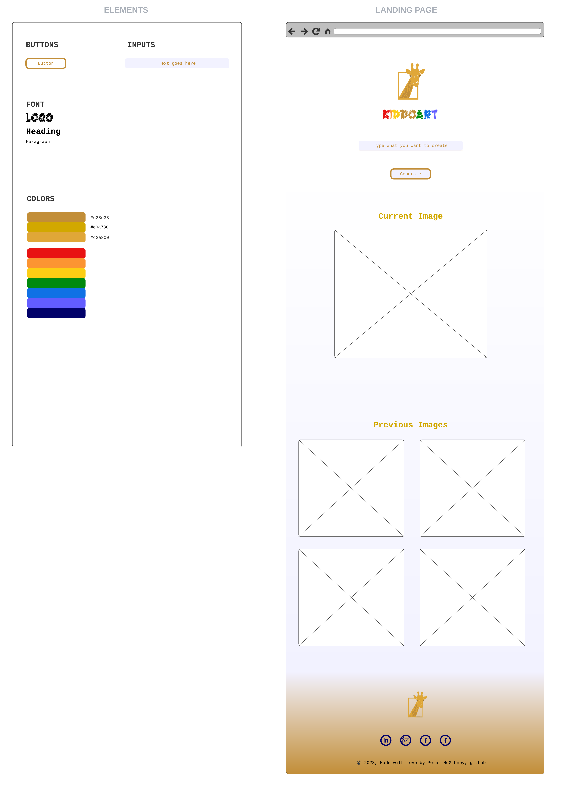

# Overview

Kiddoart is an image generation application used for young toddler education. It uses OpenAI's, DALL-E API for image creation to provide the best user experience for your little one. Please note: the current status of this project is in the `PRE-ALPHA` phase. So far, it comprises the complete landing page with an open ended image generation (no filter has been applied at this stage). Please standby for future updates to the functionality!

## Technologies Used

## Getting Started

Follow the live link to the application [here](https://kiddoart.vercel.app/)

## Planning

### High Fidelity Wireframes

## Screenshots

## Breakdown of Application

## Front End Architecture

## Challenges

## Unsolved Problems

## Future Stretch Goals

## Resources

1.  [Static Shield Generator](https://shields.io/badges/static-badge)

2.  [Icon Slug Library](https://github.com/simple-icons/simple-icons/blob/master/slugs.md)

3.  [Badges](https://ileriayo.github.io/markdown-badges/#markdown-badges)

4.  [ESLint Changelog](https://github.com/conventional-changelog/commitlint)

5.  [Wireframes](https://lucid.app/lucidchart/0d1b57af-04a3-43fa-8717-03812278a9fb/edit?viewport_loc=-234%2C-934%2C3336%2C3558%2C0_0&invitationId=inv_4f9a9ecd-5788-4f28-99b5-6992b22aa47f)

6.  [Color Palette](https://coolors.co/668586-82aeb1-57ad5a-a7acd9-9e8fb2)
